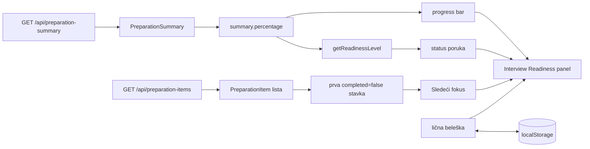

# Plan implementacije: Interview Readiness

## Status i pravilo rada

- Status: plan je spreman; implementacija nije započeta.
- Ovaj dokument je jedina promena napravljena za ovaj predlog.
- Nijedan aplikacioni, test, build ili konfiguracioni fajl nije promenjen.
- Pre svake buduće izmene traži se posebno odobrenje korisnika za tačno imenovan fajl i opisanu promenu.
- Commit, push, pull request i Vercel deployment radi korisnik, ne AI agent.

## Kratak opis

**Interview Readiness** je mali personalizovani panel koji koristi već učitane podatke, bez novog API-ja i bez izmene baze. Panel:

- prikazuje progress bar iz `summary.percentage`;
- pretvara procenat u razumljivu statusnu poruku;
- prikazuje prvu nezavršenu stavku kao **Sledeći fokus**;
- omogućava kratku ličnu belešku koja ostaje sačuvana u browseru preko `localStorage`.

Jednorečenično objašnjenje dodatka:

> Dodat je personalizovani Interview Readiness panel koji koristi server summary podatke, prikazuje status pripreme i čuva lokalnu belešku u browseru, uz testiranu logiku za readiness nivoe.

## Zašto je dodatak odgovarajućeg obima

- Vidljiv je odmah na javnoj stranici.
- Ima testiranu poslovnu logiku i nije samo dekoracija.
- Koristi postojeće `PreparationSummary` i `PreparationItem` podatke.
- Ne zahteva novi dependency.
- Ne menja backend, API ugovor, Upstash podatke ili autentikaciju.
- Ne menja postojeći deployment tok.
- Može se objasniti i demonstrirati za manje od jednog minuta.
- Ne uvodi veliki vizuelni refaktor pred deployment.

## Provera postojećih oslonaca

Plan ne pretpostavlja da sve navedene funkcije već postoje. Postojeći oslonci su provereni u trenutnom kodu, dok su nove funkcije jasno označene kao deo buduće implementacije.

### Već postoji

| Oslonac | Lokacija | Kako se koristi |
|---|---|---|
| `getPreparationSummary()` | `client/apiClient.ts` | Daje postojeći `PreparationSummary`, uključujući `percentage`. |
| `getPreparationItems()` | `client/apiClient.ts` | Daje postojeću listu `PreparationItem` za izbor prve nezavršene stavke. |
| Tip `PreparationSummary` | `client/apiClient.ts` | Već sadrži `total`, `completed`, `remaining` i `percentage`. |
| Tip `PreparationItem` | `client/apiClient.ts` | Već sadrži `id`, `title` i `completed`. |
| `InterviewPreparationPage.start()` | `client/main.ts` | Postojeće mesto za registraciju listenera i početno učitavanje beleške. |
| `refresh()` | `client/main.ts` | Već paralelno učitava health, items i summary podatke. |
| `loadItems()` / `renderItems()` | `client/main.ts` | Postojeći tok u koji se dodaje prikaz sledećeg fokusa. |
| `loadSummary()` / `renderSummary()` | `client/main.ts` | Postojeći tok u koji se dodaju progress i readiness status. |
| `clearSummary()` | `client/main.ts` | Postojeći error/reset obrazac koji se proširuje na readiness prikaz. |
| `requireElement()` | `client/main.ts` | Postojeći tipizovani način pronalaženja DOM elemenata. |
| `localStorage` | Standardni browser API | Dostupan je u browseru; koristiće se samo kroz zaštićeni `try/catch`. |
| `<progress>` i `HTMLProgressElement` | Standardni HTML/DOM API | Dostupni su zato što postojeći `tsconfig.json` uključuje DOM biblioteku. |
| `HTMLTextAreaElement` | Standardni DOM API | Dostupan je kroz isti postojeći TypeScript DOM setup. |
| Build za `client/**/*.ts` | `tsconfig.build.json` | Automatski će uključiti novi `client/readiness.ts`. |
| Test glob `tests/*.test.ts` | `package.json` | Automatski će uključiti novi `tests/readiness.test.ts`. |
| Kopiranje HTML/CSS fajlova | `scripts/copy-static.mjs` | Već kopira izmenjene `public/index.html` i `public/styles.css` u `dist/`. |

### Tek treba napraviti

| Nova celina | Planirana lokacija | Razlog |
|---|---|---|
| Tip `ReadinessLevel` | `client/readiness.ts` | Ograničava rezultat na tri dozvoljene statusne poruke. |
| `getReadinessLevel(percentage)` | `client/readiness.ts` | Centralizuje i omogućava unit testiranje granica `40` i `75`. |
| Readiness DOM reference | `client/main.ts` | Povezuju novi HTML panel sa postojećim podacima. |
| Prikaz sledećeg fokusa | `client/main.ts` | Koristi postojeći niz i standardni `Array.find`; ne zahteva novi API. |
| Učitavanje/čuvanje beleške | `client/main.ts` | Mala browser-only logika oko standardnog `localStorage` API-ja. |

Zaključak: postoje svi infrastrukturni i podatkovni preduslovi za plan. Nema potrebe za novim backend endpointom, dependency-jem, build izmenom ili promenom API ugovora. Nove funkcije su male, lokalne i navedene u approval koracima u nastavku.

## Precizan funkcionalni ugovor

### Readiness nivoi

Čista funkcija `getReadinessLevel(percentage)` mapira procenat iz domena `0–100` na tačno jednu poruku:

| Procenat | Poruka |
|---:|---|
| `0–39` | `Zagrevanje` |
| `40–74` | `Na dobrom putu` |
| `75–100` | `Spremno za intervju` |

Granične vrednosti koje moraju biti eksplicitno testirane:

| Ulaz | Očekivani rezultat |
|---:|---|
| `0` | `Zagrevanje` |
| `39` | `Zagrevanje` |
| `40` | `Na dobrom putu` |
| `74` | `Na dobrom putu` |
| `75` | `Spremno za intervju` |
| `100` | `Spremno za intervju` |

Funkcija je browser-nezavisna: ne pristupa DOM-u, `localStorage`-u, mreži ili environment promenljivama. Browser deo samo poziva funkciju i prikazuje vraćenu poruku.

### Progress bar

- Vrednost dolazi isključivo iz server summary odgovora: `summary.percentage`.
- Koristi se semantički HTML `<progress>` element sa `max="100"`.
- Vidljivi tekst procenta ostaje dostupan pored progress bara.
- Kada summary nije dostupan, panel prikazuje neutralno početno stanje bez lažnog procenta.
- Postojeća summary kartica ostaje nepromenjenog ugovora i nastavlja da prikazuje svoje četiri vrednosti.

### Sledeći fokus

- Iz već učitane liste bira se prva stavka za koju je `completed === false`.
- Čuva se postojeći redosled stavki; nema sortiranja ni novog API zahteva.
- Prikazuje se samo naslov stavke, bez izmene seed podataka.
- Ako su sve stavke završene, prikazuje se jasna poruka poput `Sve stavke su završene.`
- Ako lista nije dostupna, prikazuje se neutralna poruka i ne ostaje stara vrednost iz prethodnog uspešnog učitavanja.

### Lična beleška

- Polje ima labelu `Moj fokus za sledeći intervju`.
- Beleška se čuva lokalno pod stabilnim ključem `week2:interview-readiness-note`.
- Vrednost se učitava pri pokretanju stranice i čuva pri promeni sadržaja.
- Predloženo ograničenje je najviše 280 karaktera.
- Beleška se nikada ne šalje API-ju, Upstash-u, Vercel logovima ili analytics servisu.
- Ako `localStorage` nije dostupan, ostatak aplikacije nastavlja da radi; beleška ostaje upotrebljiva samo tokom te sesije, uz kratku nenametljivu statusnu poruku.
- Korisniku se ne sugeriše da u belešku upisuje tajne ili osetljive podatke.

## Predloženi izgled

Panel se dodaje posle postojećeg grida sa listom i summary karticom, a pre footera:

```text
┌──────────────────────────────────────────────────────────────┐
│ INTERVIEW READINESS                                          │
│                                                              │
│ Na dobrom putu                                      38%      │
│ [███████████████─────────────────────────]                    │
│                                                              │
│ Sledeći fokus                                                │
│ Pripremi STAR primer za timski rad                           │
│                                                              │
│ Moj fokus za sledeći intervju                                │
│ [__________________________________________________________] │
│ Beleška se čuva samo u ovom browseru.                         │
└──────────────────────────────────────────────────────────────┘
```

Panel vizuelno koristi postojeće boje, radius, senke i tipografiju. Cilj je sklad sa postojećim dizajnom, ne redizajn stranice.

## Tok podataka



Važne granice:

- summary i items nastavljaju da se učitavaju postojećim paralelnim tokom;
- readiness prikaz se ažurira kada stigne odgovarajući podatak;
- localStorage tok je potpuno odvojen od servera;
- nijedan podatak iz beleške ne prelazi browser granicu.

## Fajlovi u obimu

| Fajl | Predložena promena |
|---|---|
| `client/readiness.ts` | Novi mali modul sa tipom readiness nivoa i čistom funkcijom `getReadinessLevel`. |
| `tests/readiness.test.ts` | Novi unit test sa šest obaveznih graničnih primera. |
| `public/index.html` | Semantička struktura panela: progress, status, sledeći fokus, labela i textarea. |
| `client/main.ts` | Povezivanje postojećih summary/items rezultata sa panelom i bezbedno učitavanje/čuvanje beleške. |
| `public/styles.css` | Lokalizovani stilovi panela, progress bara, beleške i responsive ponašanja. |

Postojeći build već kompajlira sve `client/**/*.ts`, test komanda već pokreće sve `tests/*.test.ts`, a build već kopira `public/index.html` i `public/styles.css`. Zato nisu potrebne izmene `package.json`, TypeScript konfiguracije ili build skripti.

## Fajlovi van obima

- `api/**`;
- `server/**`;
- Upstash konfiguracija i seed podaci;
- `.env` i `.env.example`;
- `package.json` i `package-lock.json`;
- `vercel.json`;
- `scripts/**`;
- ručno menjanje `dist/**`;
- novi framework, dependency, analytics ili autentikacija.

Ako implementacija pokaže da je potreban bilo koji fajl van definisanog obima, rad se zaustavlja, iznosi se konkretan razlog i traži novo odobrenje.

## Plan implementacije sa approval gate-ovima

### Korak 1 — čista readiness logika

Predloženi fajl: `client/readiness.ts`.

- Definisati mali union tip za tri dozvoljene poruke.
- Implementirati `getReadinessLevel(percentage)` pomoću dve jasne granice: `< 40`, `< 75`, inače završni nivo.
- Ne dodavati DOM ili storage logiku u ovaj modul.

Provera posle izmene:

- TypeScript typecheck mora da prođe.
- Pregled diff-a mora pokazati samo novi mali modul.

**Odobrenje:** tražiti pre kreiranja ovog fajla.

### Korak 2 — unit testovi graničnih vrednosti

Predloženi fajl: `tests/readiness.test.ts`.

- Koristiti postojeće `node:test` i `node:assert/strict` alate.
- Pokriti tačno vrednosti `0`, `39`, `40`, `74`, `75` i `100`.
- Grupisati primere tako da se granice lako čitaju iz testa.
- Ne uvoditi novu test biblioteku.

Provera posle izmene:

- novi ciljani test prolazi;
- kompletan `npm.cmd test` ostaje zelen i bez `todo` testova.

**Odobrenje:** tražiti pre kreiranja ovog fajla.

### Korak 3 — semantička HTML struktura panela

Predloženi fajl: `public/index.html`.

- Dodati jedan novi `<section>` sa jasnim heading/label vezama.
- Dodati `<progress max="100">`, status tekst i vidljivi procenat.
- Dodati element za **Sledeći fokus**.
- Dodati `<label>` i `<textarea maxlength="280">` za ličnu belešku.
- Dodati tekst da se beleška čuva samo u browseru.
- Postaviti neutralne početne vrednosti koje ne tvrde da je zahtev već uspeo.

Provera posle izmene:

- postojeći ID-jevi ostaju jedinstveni;
- stranica ostaje čitljiva bez JavaScript-a;
- nema inline skripti ili tajnih vrednosti.

**Odobrenje:** tražiti pre izmene ovog fajla.

### Korak 4 — browser povezivanje

Predloženi fajl: `client/main.ts`.

- Importovati `getReadinessLevel` iz novog modula.
- Bezbedno pronaći nove DOM elemente kroz postojeći `requireElement` obrazac.
- U summary prikazu postaviti progress vrednost, procenat i readiness poruku.
- U items prikazu pronaći prvu nezavršenu stavku i prikazati je kao fokus.
- U error granama očistiti readiness vrednosti da stari rezultat ne ostane vidljiv.
- Pri `start()` učitati lokalnu belešku i registrovati event listener za čuvanje.
- Ograditi `localStorage` operacije sa `try/catch` tako da storage greška ne prekine aplikaciju.
- Ne slati dodatni API zahtev i ne menjati postojeći paralelni refresh tok.

Provera posle izmene:

- TypeScript typecheck prolazi;
- summary i items greške ostaju nezavisne;
- beleška se ne pojavljuje u request payload-u ili URL-u.

**Odobrenje:** tražiti pre izmene ovog fajla.

### Korak 5 — stilovi bez redizajna

Predloženi fajl: `public/styles.css`.

- Uskladiti panel sa postojećim `.panel` izgledom.
- Stilizovati progress bar uz očuvanu semantičku vrednost.
- Dodati fokus-visible stil za textarea.
- Obezbediti čitljiv textarea i status teksta.
- Na uskom ekranu koristiti jednu kolonu bez horizontalnog skrola.
- Ne menjati globalnu paletu ili postojeći layout osim koliko je potrebno da se novi panel uklopi.

Provera posle izmene:

- panel je čitljiv na desktop i mobilnoj širini;
- postojeće kartice i dugme ostaju vizuelno stabilni;
- fokus stanje je jasno vidljivo tastaturom.

**Odobrenje:** tražiti pre izmene ovog fajla.

### Korak 6 — završna verifikacija

Ovaj korak ne menja source fajlove, ali se rezultat beleži pre commita.

Automatske provere:

1. `npm.cmd test`;
2. `npm.cmd run build`;
3. pregled novog `dist/` inventara;
4. `npm.cmd run verify:solution`;
5. lokalni smoke sa očekivanim summary statusom `200`;
6. `git diff --check`, `git diff` i `git status`.

Ručne browser provere:

1. `38%` iz server summary-ja daje `Zagrevanje` prema definisanim granicama;
2. progress bar prikazuje istu vrednost kao summary kartica;
3. **Sledeći fokus** prikazuje prvu nezavršenu seed stavku;
4. unos beleške ostaje posle refresh-a;
5. pražnjenje beleške uklanja sačuvanu vrednost ili čuva prazan sadržaj na dosledan način;
6. stranica ostaje upotrebljiva kada je localStorage blokiran;
7. Network pregled ne pokazuje zahtev koji sadrži ličnu belešku;
8. postojeće health, items i summary funkcije i dalje rade;
9. mobilni prikaz nema horizontalni skrol;
10. panel je upotrebljiv tastaturom.

**Odobrenje:** pre pokretanja završnog build/smoke paketa potvrditi da su sve prethodne izmene pregledane.

## Stanja i ponašanje pri grešci

| Situacija | Očekivano ponašanje |
|---|---|
| Summary se učitava | Progress i status imaju neutralno loading stanje. |
| Summary uspe (`200`) | Progress, procenat i readiness poruka se ažuriraju zajedno. |
| Summary padne | Readiness procenat/status se brišu ili vraćaju na neutralno stanje; postojeća API greška ostaje vidljiva. |
| Items se učitavaju | Sledeći fokus ima neutralno loading stanje. |
| Items uspeju | Prikazuje se prva nezavršena stavka. |
| Sve stavke su završene | Prikazuje se `Sve stavke su završene.` |
| Items zahtev padne | Fokus se čisti i prikazuje se neutralna poruka; ne prikazuje se stari naslov. |
| localStorage radi | Beleška se učitava i ostaje posle refresh-a. |
| localStorage je blokiran | Aplikacija ne pada; server podaci i panel nastavljaju da rade. |

## Kriterijumi prihvatanja

- Novi panel je vidljiv, smislen i uklopljen u postojeći dizajn.
- Progress vrednost uvek dolazi iz `summary.percentage` i slaže se sa summary karticom.
- `0–39` prikazuje `Zagrevanje`.
- `40–74` prikazuje `Na dobrom putu`.
- `75–100` prikazuje `Spremno za intervju`.
- Svih šest graničnih primera je pokriveno unit testom.
- **Sledeći fokus** je prva nezavršena stavka u postojećem redosledu.
- Slučaj bez nezavršenih stavki ima jasnu završnu poruku.
- Lična beleška preživljava refresh u istom browser origin-u.
- Beleška se ne šalje serveru niti se nalazi u Git-u ili `dist/` kao korisnička vrednost.
- Storage greška ne obara aplikaciju.
- Nema novih dependency-ja i nema izmene API/backend/Upstash ugovora.
- `npm test`, `npm run build` i `npm run verify:solution` prolaze.
- Postojeći lokalni smoke ostaje zelen sa summary statusom `200`.
- `dist/` ostaje bez tajni, TypeScript source-a, server koda i testova.
- Ručni desktop, mobilni, keyboard i persistence pregled prolaze.

## Rizici i kontrole

| Rizik | Kontrola |
|---|---|
| Status granice se razlikuju između testa i browsera | Browser koristi jednu izdvojenu i testiranu funkciju. |
| Progress prikazuje client-side izračunatu vrednost različitu od servera | Direktno koristiti `summary.percentage`, bez ponovnog računanja. |
| Paralelni items/summary zahtevi naprave nedosledan panel | Svaki odgovor ažurira samo deo panela za koji je odgovoran. |
| Stara vrednost ostane nakon neuspešnog refresh-a | Error grane eksplicitno vraćaju pogođeni deo u neutralno stanje. |
| localStorage izuzetak prekine start aplikacije | Sve storage operacije su izolovane kroz `try/catch`. |
| Beleška postane server-side podatak ili tajna | Ne dodavati je API ugovoru; jasno označiti da ostaje samo u browseru. |
| CSS preraste u redizajn | Dodati samo lokalizovane klase novog panela i responsive minimum. |
| Build ne uključi novi modul ili statičke izmene | Pokrenuti svež build i pregledati kompajlirani `dist/`. |
| Personal touch pokvari zeleni minimum | Pokrenuti kompletan postojeći solution i smoke paket posle dodatka. |

## Predloženi redosled odobrenja

Nakon što korisnik pročita plan, odobrenja se traže pojedinačno:

1. kreiranje `client/readiness.ts`;
2. kreiranje `tests/readiness.test.ts`;
3. izmena `public/index.html`;
4. izmena `client/main.ts`;
5. izmena `public/styles.css`;
6. završni build, test, smoke i Git pregled;
7. eventualna dodatna izmena samo ako provera pokaže konkretan problem.

Nakon svakog koraka agent saopštava rezultat provere i tek zatim traži odobrenje za sledeći korak.
