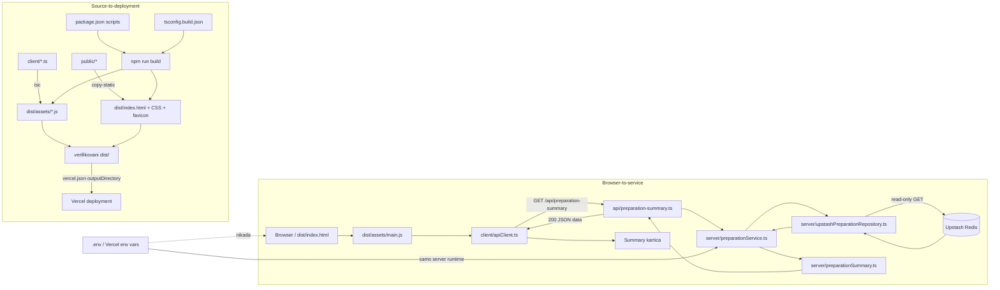

# Plan: otklanjanje 404 greške i prikaz server-side pregleda

## Status i pravilo rada

- Status: lokalni minimum je implementiran i verifikovan; javni deployment i remote smoke još nisu dokazani.
- Dokument je prvobitno nastao pre implementacije, a ova dopuna beleži mapu projekta i stanje dokaza posle lokalne realizacije.
- Sve izmene aplikacije rađene su uz pojedinačna odobrenja korisnika. Lokalni `.env` nije menjan kroz implementaciju niti je commitovan.
- Vercel URL, remote rezultat i doprinos drugog člana para ne smeju se upisati kao završene činjenice dok stvarno ne postoje.

## Cilj

Omogućiti da kartica **Server-side računanje / Pregled pripreme**:

1. poziva postojeću API rutu bez 404 greške;
2. učita iste stavke koje server čita iz podešenog read-only Upstash izvora;
3. na serveru izračuna i vrati `total`, `completed`, `remaining` i `percentage`;
4. prikaže očekivani rezultat za seed podatke: `8 / 3 / 5 / 38%`;
5. radi lokalno i na Vercel deployment-u bez izlaganja tajni browseru.

## Pregledana dokumentacija i ograničenja

Pregledani su svi dokumenti koji stvarno postoje u trenutnom Git stablu:

- `README.md`;
- `.env.example` kao dokumentovani primer konfiguracije;
- `package.json`, obe TypeScript konfiguracije, `.gitignore` i `vercel.json` kao projektna konfiguracija;
- kompletan tok kroz `client/`, `api/`, `server/`, `scripts/`, `tests/` i statički `public/` sadržaj.

README navodi sledeće dokumente, ali oni ne postoje ni u radnom stablu ni u trenutnom `HEAD` commit-u:

- `docs/project-anatomy.md`;
- `docs/deployment-guide.md`;
- `docs/evidence-checklist.md`;
- `docs/troubleshooting.md`.

Njihov sadržaj zato nije mogao biti pregledan. Plan se oslanja na postojeći README, kod, testove i verifikacione skripte. Ne planira se izmišljanje ili rekonstrukcija nestalih dokumenata bez posebnog zahteva.

README definiše tri namerna starter problema i očekivani osnovni obim od četiri fajla:

1. pogrešno povezana browser ruta;
2. neimplementiran summary;
3. pogrešan Vercel output direktorijum.

Granica rada ostaje ista: bez izmene seed podataka, Upstash repository-ja, API ugovora, autentikacije, UI dizajna, Vercel providera ili build arhitekture.

## Utvrđeno trenutno stanje

### 1. Neposredan uzrok vidljivog 404 odgovora

`client/apiClient.ts` za summary šalje zahtev na:

```text
/api/preparation-summaries
```

Međutim, postojeća serverless funkcija je `api/preparation-summary.ts`, a lokalni server i smoke provera registruju:

```text
/api/preparation-summary
```

Zbog razlike množina/jednina browser završava na nepostojećoj ruti. Lokalni server zato ispravno vraća `404 NOT_FOUND` sa porukom „API ruta ne postoji.” Zahtev u toj tački uopšte ne stiže do summary handlera niti do baze.

### 2. Sledeći očekivani problem posle ispravke rute

Ispravka URL-a sama po sebi neće dati rezultate. Singularna ruta trenutno:

1. poziva `loadPreparationItems()`;
2. čita podatke iz Upstash-a, osim kada je eksplicitno uključen testni `fallback` režim;
3. poziva `createPreparationSummary(items)`;
4. dobija `SummaryNotImplementedError`, jer je funkcija namerno nedovršena;
5. mapira grešku u `501 SUMMARY_NOT_IMPLEMENTED`.

Zato su potrebne i ispravka browser rute i implementacija računanja. To su dva odvojena signala i treba ih proveravati tim redom: `404 -> 501 -> 200`.

### 3. Tok podataka iz baze

Planirani tok ostaje postojeći:

```text
Browser
  -> GET /api/preparation-summary
  -> api/preparation-summary.ts
  -> loadPreparationItems()
  -> readRedisRuntimeConfig()
  -> readPreparationItemsFromUpstash()
  -> read-only Redis GET za UPSTASH_PREPARATION_KEY
  -> parsePreparationItems()
  -> createPreparationSummary()
  -> { data: { total, completed, remaining, percentage } }
  -> prikaz u browseru
```

Upstash token ostaje isključivo na serveru. Browser dobija samo javni JSON rezultat.

### 4. Deployment problem koji bi sakrio ispravku

`npm run build` pravi provereni browser output u `dist/`, ali `vercel.json` trenutno postavlja `outputDirectory` na `public`. Zbog toga Vercel nije usmeren na isti output koji lokalni build i `check-dist` proveravaju. Čak i ispravan TypeScript source može ostati neobjavljen ili objavljen bez očekivanih kompajliranih asseta.

### 5. Testovi i početni dokaz

Trenutni rezultat `npm.cmd test`:

- 9 testova prolazi;
- 0 testova pada;
- 1 test je `todo`: summary test.

`node scripts/check-starter.mjs` potvrđuje sva tri namerna starter stanja: pluralnu browser putanju, summary `todo`/izuzetak i Vercel `public` output.

Read-only pokušaj učitavanja Upstash podataka iz trenutnog izvršnog okruženja završio se sa `ExternalServiceError: Upstash servis nije dostupan.` Pošto repository namerno skriva niži mrežni uzrok, ovim nije utvrđeno da li je problem DNS/mrežno ograničenje okruženja, dostupnost instance ili konfiguracija. Ovu proveru treba ponoviti posle rotacije tokena i tokom lokalnog smoke testa. Ona nije uzrok trenutno viđenog summary 404 odgovora.

### 6. Bezbednosni nalaz van očekivana četiri fajla

Lokalni `.env` postoji i nije praćen Git-om, ali trenutni `.gitignore` ne sadrži pravila za `.env`, `dist/` i `node_modules/`. Sva tri se zato vide kao untracked, suprotno README kriterijumu da ne budu commit-ovani.

Tokom dijagnostike read-only Upstash token je prikazan u izlazu lokalne pretrage. Vrednost se ne ponavlja u ovom dokumentu. Token treba smatrati kompromitovanim i rotirati ga pre daljeg rada ili deployment-a. Rotacija je spoljašnja bezbednosna radnja koju korisnik obavlja u Upstash-u; nije izmena koda.

## Plan implementacije sa zasebnim odobrenjima

### Faza 0 — bezbednosni preduslov

#### Promena 0A: rotacija read-only Upstash tokena

- Korisnik opoziva postojeći read-only token i generiše novi sa najmanjim potrebnim ovlašćenjima.
- Korisnik ažurira samo lokalni `.env` i kasnije Vercel environment variable.
- Novi token se ne šalje u razgovor, ne ispisuje u terminal i ne stavlja u browser kod.
- Prelazni kriterijum: stari token više nije važeći, a novi postoji samo u tajnim konfiguracijama.

Odobrenje/akcija: zahteva eksplicitnu potvrdu korisnika; agent neće menjati `.env` niti Upstash nalog.

#### Promena 0B: zaštita lokalnih i generisanih fajlova

Predloženi fajl: `.gitignore`.

- Dodati `.env`, `dist/` i `node_modules/`.
- Zadržati postojeća pravila.
- Proveriti da `git status --short` više ne nudi ove lokalne/generisane fajlove za commit.

Obrazloženje dodatnog, petog fajla: promena nije deo tri starter zadatka, ali je konkretno potrebna da bi se ispunio README bezbednosni kriterijum i sprečio slučajan commit tajne. Biće traženo zasebno odobrenje; može biti odložena, ali deployment/commit ne treba raditi pre nje.

### Faza 1 — ispravka browser-to-service povezivanja

Predloženi fajl: `client/apiClient.ts`.

- U `getPreparationSummary()` promeniti samo putanju sa pluralne na postojeću singularnu rutu `/api/preparation-summary`.
- Ne menjati HTTP metod, envelope tipove, prikaz greške ili API ugovor.
- Ne praviti novu API rutu i ne preimenovati postojeću serverless funkciju.

Očekivani međurezultat:

- browser više ne dobija `404 API ruta ne postoji`;
- dok summary još nije implementiran, dobija očekivani `501 SUMMARY_NOT_IMPLEMENTED`;
- Network kartica potvrđuje singularni request URL.

Odobrenje: tražiti pre izmene samo ovog fajla.

### Faza 2 — server-side računanje

Predloženi fajl: `server/preparationSummary.ts`.

Implementirati čistu funkciju nad prosleđenim nizom:

- `total = items.length`;
- `completed = broj stavki za koje je completed === true`;
- `remaining = total - completed`;
- `percentage = 0` kada je `total === 0`;
- u ostalim slučajevima `percentage` je najbliži ceo broj za `completed / total * 100`.

Funkcija ne sme da:

- menja ulazni niz ili njegove stavke;
- čita environment variables;
- poziva bazu ili mrežu;
- menja postojeći `PreparationSummary` ugovor;
- vraća decimalni procenat ili deli nulom.

Očekivani primeri:

| Ulaz | total | completed | remaining | percentage |
|---|---:|---:|---:|---:|
| 8 stavki, 3 završene | 8 | 3 | 5 | 38 |
| prazan niz | 0 | 0 | 0 | 0 |

Pošto API handler već prvo učitava stavke preko `loadPreparationItems()`, nije potrebna promena handlera, service sloja ili repository-ja.

Odobrenje: tražiti pre izmene samo ovog fajla.

### Faza 3 — zamena `todo` testa stvarnim testovima

Predloženi fajl: `tests/preparationSummary.test.ts`.

- Ukloniti `test.todo`.
- Dodati test za seed oblik sa osam stavki i tri završene; očekivati tačno `{ total: 8, completed: 3, remaining: 5, percentage: 38 }`.
- Dodati test za prazan niz; očekivati četiri nule.
- Koristiti postojeći Node test/assert stil bez nove biblioteke.
- Testirati javno ponašanje funkcije, ne detalje implementacije.

Odobrenje: tražiti pre izmene samo ovog fajla.

### Faza 4 — usklađivanje Vercel output-a

Predloženi fajl: `vercel.json`.

- Zadržati postojeći `buildCommand`.
- Promeniti samo `outputDirectory` sa `public` na `dist`.
- Ne menjati provider, serverless `api/` raspored ili build arhitekturu.

Očekivani rezultat: Vercel objavljuje isti kompajlirani browser output koji su prethodno proverili `npm run build` i `scripts/check-dist.mjs`.

Odobrenje: tražiti pre izmene samo ovog fajla.

## Redosled verifikacije

Svaka provera se pokreće tek nakon odobrene promene kojoj pripada. Provere ne smeju menjati source fajlove.

1. Posle promene rute:
   - pretražiti source i potvrditi da browser koristi samo singularnu summary putanju;
   - izgraditi svež `dist/`, jer browser ne izvršava direktno `client/*.ts`;
   - u Network tabu ili lokalnim zahtevom potvrditi da je signal prešao sa `404` na `501` dok faza 2 još nije završena.
2. Posle računanja i testova:
   - pokrenuti ciljani summary test;
   - pokrenuti `npm.cmd test` i zahtevati 0 fail / 0 todo;
   - pokrenuti TypeScript proveru bez emitovanja.
3. Posle Vercel izmene:
   - pokrenuti `npm.cmd run build`;
   - potvrditi `dist/` inventar: statički fajlovi i `assets/*.js`, bez `.env`, tokena, TypeScript source-a, mapa, server koda ili testova;
   - pokrenuti `npm.cmd run verify:solution`.
4. Lokalna integracija sa fallback podacima:
   - očekivati da sve smoke provere prođu sa summary statusom `200` i rezultatom `8 / 3 / 5 / 38`.
5. Lokalna integracija sa pravim Upstash podešavanjem:
   - potvrditi da health prijavljuje pronađenu servisnu konfiguraciju;
   - potvrditi `200` i osam stavki sa `/api/preparation-items`;
   - potvrditi `200` i očekivani summary sa `/api/preparation-summary`;
   - ako Upstash i dalje nije dostupan, sačuvati status/bezbednu grešku bez tokena i odvojeno dijagnostikovati mrežu, URL, token i ključ. Ne uvoditi fallback kao prikriveno produkciono rešenje.
6. Pre commita:
   - pregledati `git diff` i `git status`;
   - očekivani osnovni diff ograničiti na četiri starter fajla, uz zasebno odobreni `.gitignore` i ovaj planski dokument;
   - potvrditi da `.env`, `dist/`, `node_modules/` i `.vercel/` nisu praćeni.
7. Posle korisnikovog zasebnog odobrenja za deployment:
   - postaviti rotirane environment variables u Vercel-u;
   - objaviti branch;
   - pokrenuti remote smoke prema javnom URL-u sa očekivanim summary statusom `200`.

## Kriterijumi prihvatanja

- Browser šalje `GET /api/preparation-summary`, bez pluralne varijante.
- Summary API vraća `200` i postojeći `{ data: PreparationSummary }` ugovor.
- Seed rezultat je tačno `total=8`, `completed=3`, `remaining=5`, `percentage=38`.
- Prazan niz vraća četiri nule.
- Podaci se učitavaju kroz postojeći `loadPreparationItems()` i read-only Upstash `GET` tok; nema Redis write operacija.
- `npm test` prolazi bez `todo` testova.
- `npm run build` pravi čist `dist/`.
- `npm run verify:solution` prolazi.
- Lokalni fallback smoke i lokalni pravi Upstash smoke prolaze sa statusom `200`.
- Vercel koristi `dist` i remote smoke prolazi sa statusom `200`.
- Nijedna tajna nije u Git-u, `dist/` sadržaju, browser bundle-u, logu ili odgovoru API-ja.
- Stari, izloženi read-only token je opozvan pre commita/deployment-a.

## Rizici i način kontrole

| Rizik | Kontrola |
|---|---|
| Ispravi se samo 404, pa korisnik dobije 501 | Implementirati i testirati summary kao zasebnu fazu. |
| Source je ispravljen, ali browser i dalje koristi stari bundle | Posle client izmene obavezno napraviti svež `dist/`; ne uređivati `dist/` ručno. |
| Lokalni fallback prikrije kvar Upstash-a | Pokrenuti odvojene fallback i real-configuration smoke provere. |
| Vercel objavi `public/` umesto kompajliranog output-a | Uskladiti `outputDirectory` sa `dist/` i proveriti javni URL. |
| Token dospe u Git ili log | Rotirati token, dopuniti `.gitignore`, ne ispisivati vrednosti i pregledati diff/status. |
| Obim se proširi na nepotrebne slojeve | Ne menjati API handler, repository, seed, UI ili ugovor bez novog konkretnog dokaza i odobrenja. |

## Predloženi approval gate-ovi

Implementacija ne počinje automatski. Nakon što korisnik pročita plan, sledeće odluke se traže pojedinačno i navedenim redom:

1. potvrda da je stari Upstash token rotiran;
2. odobrenje za `.gitignore`;
3. odobrenje za `client/apiClient.ts`;
4. odobrenje za `server/preparationSummary.ts`;
5. odobrenje za `tests/preparationSummary.test.ts`;
6. odobrenje za `vercel.json`;
7. zasebno odobrenje za commit/push/deployment, samo ako ih korisnik želi.

Ako bilo koja provera otkrije potrebu za drugim fajlom, rad se zaustavlja, iznosi se konkretan dokaz i traži novo odobrenje pre te dodatne promene.

## Mapa projekta

### Klasifikacija glavnih stavki

| Stavka | Kategorija | Uloga |
|---|---|---|
| `client/` | Source | Browser TypeScript: API klijent, učitavanje podataka i prikaz rezultata. |
| `api/` | Source | HTTP/serverless ulazne tačke: health, stavke i singularni summary endpoint. |
| `server/` | Source | Poslovna pravila, konfiguracija, validacija, Upstash read-only repository i summary računanje. |
| `public/` | Source | Ručno održavani statički HTML, CSS i favicon koji ulaze u build. |
| `scripts/` | Source / alatke | Build, lokalni server, smoke i ugovorne provere starter/solution stanja. |
| `tests/` | Source / testovi | Automatizovana provera konfiguracije, API-ja, podataka, filtriranja, repository-ja i summary funkcije. |
| `README.md` i `specs/` | Dokumentacija | Zadatak, granice rada, plan, mapa i dokazni trag. |
| `package.json` | Projektna konfiguracija | Node verzija, skripte i direktne razvojne zavisnosti. |
| `package-lock.json` | Projektna konfiguracija | Zaključane verzije celog dependency stabla za ponovljiv `npm ci`. |
| `tsconfig.json` | Projektna konfiguracija | Stroga TypeScript pravila i typecheck obim. |
| `tsconfig.build.json` | Projektna konfiguracija | Browser build iz `client/` u `dist/assets/`. |
| `.gitignore` | Projektna konfiguracija | Sprečava slučajan commit tajni, generisanog output-a i lokalnih alata. |
| `.env.example` | Javna konfiguraciona šema | Dokumentuje potrebna imena promenljivih samo sa placeholder vrednostima. |
| `vercel.json` | Deployment konfiguracija | Pokreće `npm run build` i objavljuje provereni `dist/`. |
| `.env` | Lokalna tajna | Stvarne lokalne vrednosti; ostaje van Git-a i browser bundle-a. |
| `dist/` | Generisani rezultat | Svež browser output nastao iz `client/` i `public/`; ne uređuje se ručno. |
| `node_modules/` | Generisani rezultat | Lokalne instalirane zavisnosti obnovljive preko lockfile-a. |
| `.vercel/` | Generisani lokalni metadata | Lokalna veza sa Vercel projektom; ne commit-uje se. |

### Odgovornosti i dve ključne putanje



Browser-to-service put počinje u kompajliranom browser kodu, koristi postojeći singularni endpoint, ulazi u server sloj i završava read-only čitanjem iz Upstash-a. Token se čita samo u server runtime-u. U odgovoru se vraćaju stavke ili izračunati javni brojevi, nikada token.

Source-to-deployment put spaja dva ulaza: TypeScript iz `client/` kompajlira se u `dist/assets/`, dok se statički sadržaj iz `public/` kopira u koren `dist/`. `check-dist` proverava rezultat, a `vercel.json` objavljuje upravo taj direktorijum.

## Dokaz posle lokalne realizacije

### Predato stanje

| Polje | Vrednost / dokaz |
|---|---|
| Lokalna grana | `tim-treca-smena` |
| Lokalni commit | `3537f76` — `Fix summary route, implement percentage calc, fix Vercel output` |
| Trenutni remote branch | `origin/tim-treca-smena` na forku |
| Organizacijski branch | **NEDOSTAJE:** push čeka GitHub write dozvolu i ne sme se pretpostaviti. |
| Javni Vercel URL | **NEDOSTAJE:** upisati tek posle stvarnog deployment-a. |
| Deployed commit | **NEDOSTAJE:** potvrditi SHA na Vercel deployment-u. |

### Pre/posle signali

| Kontrolisani problem | Pre | Posle | Dokaz |
|---|---|---|---|
| Browser-to-service wiring | Browser je pozivao pluralni `/api/preparation-summaries` i dobijao `404`. | Browser poziva postojeći singularni `/api/preparation-summary`; nakon implementacije dobija `200`. | Source provera, solution contract i lokalni smoke. |
| Summary implementacija | Direktni singularni endpoint je vraćao `501 SUMMARY_NOT_IMPLEMENTED`; postojao je jedan `test.todo`. | Endpoint vraća `8 / 3 / 5 / 38`, prazan niz četiri nule, a test paket nema `todo`. | 11 prolaznih testova i lokalni smoke. |
| Deployment output | `vercel.json` je pokazivao na ručno održavani `public/`. | Konfiguracija pokazuje na verifikovani `dist/`. | `check-solution` i `check-dist`; stvarni remote rezultat još čeka deployment. |

### Izvršene lokalne provere

| Provera | Rezultat |
|---|---|
| `npm.cmd test` | PROLAZI: 11 testova, 0 fail, 0 `todo`. |
| Seed summary | PROLAZI: `total=8`, `completed=3`, `remaining=5`, `percentage=38`. |
| Prazan niz | PROLAZI: sva četiri broja su `0`. |
| `npm.cmd run build` | PROLAZI: napravljen svež `dist/`. |
| `dist/` inventar | `assets/apiClient.js`, `assets/main.js`, `index.html`, `styles.css`, `sita-favicon.webp`. |
| Secret/build provera | PROLAZI: nema `.env`, `.ts`, server source-a, testova, `node_modules/`, source mapa ili Upstash markera u `dist/`. |
| `npm.cmd run verify:solution` | PROLAZI: test, solution contract, build i fallback smoke. |
| Lokalni smoke sa stvarnim Upstash tokom | PROLAZI: 11/11; učitano 8 stavki i summary `8 / 3 / 5 / 38`. Na ovom računaru Node koristi sistemski CA zbog lokalnog TLS trust-a. |
| Git secret granica | PROLAZI za pregledano stanje: `.env`, `dist/`, `node_modules/` i `.vercel/` nisu praćeni. |
| `npm.cmd ci` bez promene lockfile-a | **NEDOSTAJE:** pokrenuti i zabeležiti rezultat pre predaje. |

## Deployment-ready scenario — nije još dokaz stvarnog deployment-a

Ovaj odeljak opisuje tačan očekivani završni tok. Ne sme se koristiti kao tvrdnja da je deployment već izvršen.

1. Pushovati `tim-treca-smena` na originalni organizacijski repozitorijum kada nalog dobije `Write` dozvolu.
2. U Vercel projektu povezati odgovarajući organizacijski repository i branch/commit.
3. Za Preview, a zatim i Production okruženje, uneti bez prikazivanja vrednosti:
   - `APP_ENV`;
   - `APP_MESSAGE`;
   - `UPSTASH_REDIS_REST_URL`;
   - `UPSTASH_REDIS_REST_TOKEN`;
   - `UPSTASH_PREPARATION_KEY`.
4. Potvrditi da build koristi `npm run build` i da je output `dist`.
5. Redeployovati posle dodavanja ili izmene environment promenljivih.
6. U Vercel detaljima potvrditi da deployment odgovara predatom branch-u i SHA-u.
7. Pokrenuti remote smoke bez unošenja tajni u komandu ili dokaz:

```powershell
$env:BASE_URL="https://<JAVNI-VERCEL-URL>"
$env:EXPECT_SUMMARY_STATUS="200"
npm.cmd run smoke
```

Očekivani rezultat, koji tek treba zameniti stvarnim izlazom, jeste `Smoke passed: 11/11 checks passed.`

## Stanje kriterijuma prihvatanja

| Status | Kriterijum | Evidencija / sledeća akcija |
|---|---|---|
| NEDOSTAJE | `npm ci` obnavlja zavisnosti bez promene lockfile-a. | Pokrenuti `npm.cmd ci`, zatim potvrditi da `package-lock.json` nema diff. |
| ISPUNJENO | `npm test` prolazi bez `todo` testa. | 11/11, 0 `todo`. |
| ISPUNJENO | Seed summary je `8 / 3 / 5 / 38`. | Unit test, solution contract i smoke. |
| ISPUNJENO | Prazan niz daje četiri nule. | Unit test. |
| ISPUNJENO | Browser koristi singularni endpoint i prikazuje `200`. | Kompajlirani client, solution contract i lokalni smoke. |
| ISPUNJENO | Build pravi svež, bezbedan `dist/`. | `check-dist` prolazi; inventar je naveden iznad. |
| ISPUNJENO | Vercel output pokazuje na `dist/`. | Potvrđeno u `vercel.json`; remote efekat još čeka deployment. |
| ISPUNJENO | `npm run verify:solution` prolazi. | Ponovljeno posle audita assignmenta. |
| ISPUNJENO | Lokalni smoke prolazi sa stvarnim read-only Upstash tokom. | 11/11 sa 8 seed stavki i očekivanim summary rezultatom. |
| ISPUNJENO | `.env`, `dist/`, `node_modules/` i `.vercel/` nisu commitovani. | Git pregled i `.gitignore`. |
| NEDOSTAJE | Vercel deployment odgovara branch-u/commitu. | Upisati branch, SHA i URL tek posle stvarnog deployment-a. |
| NEDOSTAJE | Remote smoke prolazi. | Pokrenuti prema javnom URL-u i sačuvati bezbedan rezultat. |
| ZA POTVRDU PARA | Oba člana umeju da objasne mapu, foldere, putanje i granicu tajne. | Nemanja i koleginica treba da zamene uloge objašnjavanja i potvrde vežbu. |
| NEPOTPUNO | Dokaz sadrži signale, doprinos, AI belešku i ograničenje. | Signali i ograničenje postoje; nedostaju stvarni doprinosi oba člana, javni URL i remote rezultat. |

## Doprinos para i AI beleška — NACRT

### Doprinosi

- Nemanja: **NEDOSTAJE:** upisati sopstveni konkretan doprinos svojim rečima.
- Koleginica: **NEDOSTAJE:** upisati njen stvarni konkretan doprinos nakon njene potvrde.

### Beleška o korišćenju AI-ja

AI coding agent je korišćen za pregled repozitorijuma, dijagnostiku razlike između pluralne i singularne API putanje, izradu plana, kontrolisane izmene nakon eksplicitnih odobrenja i pokretanje lokalnih verifikacija. Rezultati nisu prihvaćeni samo na osnovu predloga: provereni su TypeScript proverom, unit testovima, build proverom, solution contract-om i lokalnim smoke testovima. AI nije korišćen za generisanje ili menjanje Upstash podataka. Tajne nisu namerno uključene u source ili dokaz; ranije prikazani read-only token je opozvan i rotiran.

### Poznato ograničenje

Na lokalnom Windows okruženju Node je pri direktnom Upstash pozivu prijavio `UNABLE_TO_VERIFY_LEAF_SIGNATURE`. Read-only tok i puni smoke prošli su kada je Node koristio Windows sistemsko CA skladište. Ovo nije zaobiđeno isključivanjem TLS provere. Javni Vercel TLS i remote smoke još nisu provereni.

### Stavke koje moraju ostati otvorene do stvarne predaje

- stvarni organizacijski branch/commit ili odobren PR;
- javni Vercel URL;
- potvrda deployed SHA-a;
- stvarni remote smoke rezultat;
- konkretan doprinos oba člana para;
- potvrda da su oba člana uvežbala objašnjenje projekta;
- rezultat `npm.cmd ci` bez izmene lockfile-a.
